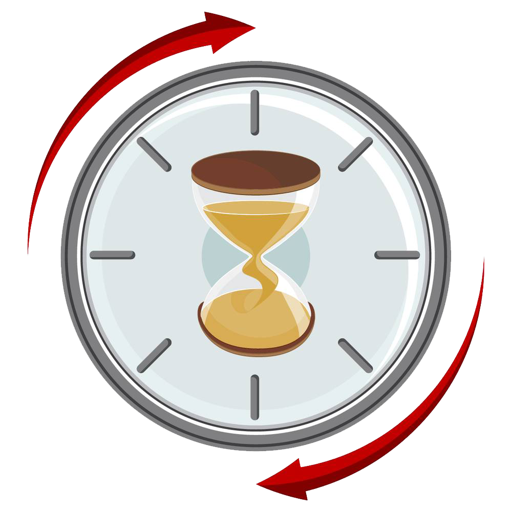
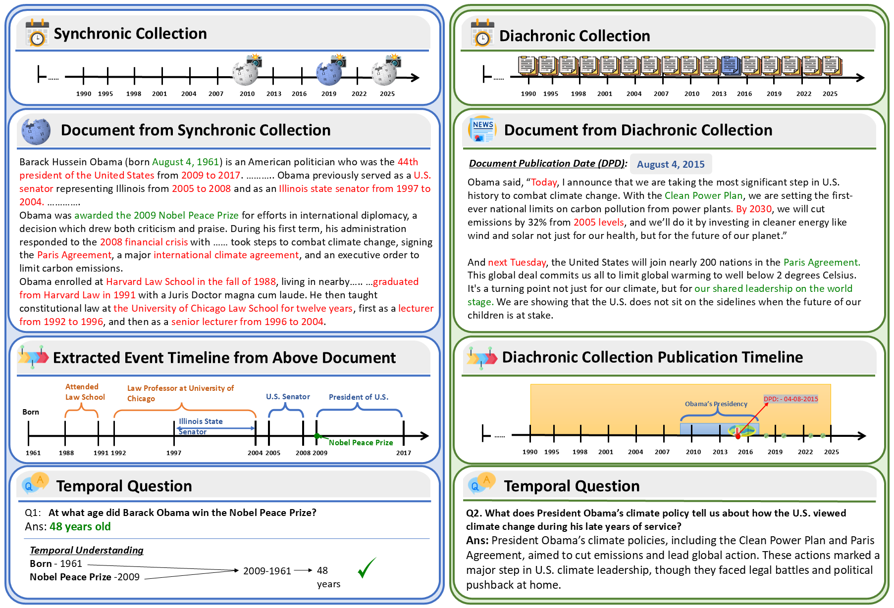

<h1 align="center">
  
  It's High Time: A Survey of Temporal Question Answering
</h1>


<p align="center">
  <strong>Bhawna Piryani</strong> · Abdelrahman Abdallah · Jamshid Mozafari · Avishek Anand · Adam Jatowt  
  <br>
  <em>University of Innsbruck · TU Delft</em>
  <br><br>
  📄 <a href="https://arxiv.org/abs/2505.20243v3">Read the Paper on arXiv</a> &nbsp;|&nbsp; 🗓️ <strong>2025</strong>
</p>

---


## 📋 Table of Contents

- [📘 Overview](#-overview)
- [📊 Datasets](#-datasets)
- [🔧 Methods & Approaches](#-methods--approaches)
- [📖 Temporal Tasks](#-temporal-tasks)
- [🏥 Domain-Specific Applications](#-domain-specific-applications)
- [🛠️ Resources & Tools](#️-resources--tools)
- [🚀 Future Directions](#-future-directions)
- [📝 Citation](#-citation)

---
### 📘 Overview

This repository accompanies our paper  on *Temporal Question Answering (TQA)* — exploring how AI models reason about time, adapt to evolving knowledge, and answer temporally constrained questions.

<p align="center">
  
</p>

---
### Key Contributions

✨ **Comprehensive Survey**: Coverage of 27+ datasets, 50+ methods spanning 2003-2025  
📊 **Unified Taxonomy**: Systematic categorization of tasks, datasets, and approaches  
🔍 **Critical Analysis**: Evaluation of current capabilities and fundamental limitations  
🚀 **Research Roadmap**: 7 critical directions for advancing temporal reasoning in AI

### Why Temporal QA Matters
Time shapes how we:
- 🗞️ **Retrieve information**: "Latest climate policies" vs. "policies from the 1990s"
- 🧠 **Reason about events**: Understanding causality, change, and evolution
- 💬 **Interact with AI**: Expecting contextually appropriate temporal grounding
- 🔄 **Adapt to change**: Handling evolving facts and knowledge updates

---

## 📊 Datasets

### Quick Statistics
- **27+ TQA Datasets** covering diverse domains and temporal scopes
- **2.5M+ Questions** spanning historical archives (1367) to real-time web (2025)
- **Dataset Categories**: Diachronic, Synchronic, Web-based, Synthetic, KG-based


### Featured Datasets

<details open>
<summary><b>🗞️ Diachronic Datasets (Time-Stamped Historical Documents)</b></summary>

| Dataset | Year | #Questions | Source | Time Coverage | Answer Type | Links |
|---------|------|-----------|--------|---------------|-------------|-------|
| **ArchivalQA** | 2022 | 532K | NYT Corpus | 1987-2007 | Extractive | [Paper](https://dl.acm.org/doi/10.1145/3477495.3531734) · [GitHub](https://github.com/WangJiexin/ArchivalQA) |
| **ChroniclingAmericaQA** | 2024 | 485K | Historical Newspapers | 1800-1920 | Extractive | [Paper](https://dl.acm.org/doi/10.1145/3626772.3657887) · [GitHub](https://github.com/datascienceUIBK/ChroniclingAmericaQA) |
| **StreamingQA** | 2022 | 147K | News Articles | 2007-2020 | Extractive | [Paper](https://proceedings.mlr.press/v162/liska22a.html) · [GitHub](https://github.com/deepmind/streamingqa) |
| **NewsQA** | 2017 | 119K | CNN/Daily Mail | 2007-2015 | Freeform | [Paper](https://aclanthology.org/W17-2623/) · [GitHub](https://github.com/Maluuba/newsqa) |
| **TempLAMA** | 2022 | 50K | News | 2010-2020 | Extractive | [Paper](https://direct.mit.edu/tacl/article/doi/10.1162/tacl_a_00459/110012/Time-Aware-Language-Models-as-Temporal-Knowledge) · [GitHub](https://github.com/google-research/language/tree/master/language/templama) |
| **TORQUE** | 2020 | 21K | News | - | Abstractive | [Paper](https://aclanthology.org/2020.emnlp-main.88/) · [GitHub](https://github.com/rujunhan/TORQUE) |
| **ForecastQA** | 2021 | 10.3K | News | 2015-2019 | Multiple Choice | [Paper](https://aclanthology.org/2021.acl-long.357/) · [Website](https://inklab.usc.edu/ForecastQA/index.html) |
| **TDDiscourse** | 2019 | 6.1K | News | Unspecified | Extractive | [Paper](https://aclanthology.org/W19-5929/) · [GitHub](https://github.com/aakanksha19/TDDiscourse) |

</details>

<details>
<summary><b>📖 Synchronic Datasets (Wikipedia Snapshots)</b></summary>

| Dataset | Year | #Questions | Time Scope | Answer Type | Multi-Hop | Links |
|---------|------|-----------|-----------|-------------|-----------|-------|
| **ComplexTempQA** | 2024 | 100.2K | 1987-2023 | Extractive | ✓ | [Paper](https://arxiv.org/abs/2406.04866) · [GitHub](https://github.com/DataScienceUIBK/ComplexTempQA) |
| **TEMPREASON** | 2023 | 52.8K | 634-2023 | Abstractive | ✗ | [Paper](https://aclanthology.org/2023.acl-long.828/) · [GitHub](https://github.com/DAMO-NLP-SG/TempReason) |
| **TimeQA** | 2021 | 41.2K | 1367-2018 | Extractive | ✗ | [Paper](https://datasets-benchmarks-proceedings.neurips.cc/paper/2021/file/1f0e3dad99908345f7439f8ffabdffc4-Paper-round2.pdf) · [GitHub](https://github.com/wenhuchen/Time-Sensitive-QA) |
| **TemporalAlignmentQA** | 2024 | 20K | 2000-2023 | Abstractive | ✗ | [Paper](https://aclanthology.org/2024.findings-acl.892.pdf) [Github](https://github.com/yizhongw/llm-temporal-alignment)|
| **SituatedQA** | 2021 | 12.2K | ≤ 2021 | Mixed | ✗ | [Paper](https://aclanthology.org/2021.emnlp-main.586/) · [GitHub](https://situatedqa.github.io/) |
| **TempTabQA** | 2023 | 11.4K | Infoboxes | Abstractive | ✗ | [Paper](https://aclanthology.org/2023.emnlp-main.149/) · [Website](https://temptabqa.github.io/) |
| **TiQ** | 2024 | 10K | Unspecified | Entities | ✗ | [Paper](https://dl.acm.org/doi/10.1145/3589335.3651895) · [GitHub](https://github.com/zhenjia2017/TIQ) |
| **PAT-Questions** | 2024 | 6.1K | Present-anchored | Extractive | ✓ | [Paper](https://aclanthology.org/2024.findings-acl.777/) · [GitHub](https://github.com/jannatmeem95/PAT-Questions) |
| **TRACIE** | 2021 | 5.4K | ≤ 2020 | Abstractive | ✗ | [Paper](https://aclanthology.org/2021.naacl-main.107/) · [GitHub](https://github.com/allenai/tracie) |
| **MenatQA** | 2023 | 2.8K | 1367-2018 | Extractive | ✗ | [Paper](https://aclanthology.org/2023.findings-emnlp.100/) · [GitHub](https://github.com/weiyifan1023/MenatQA) |

</details>

<details>
<summary><b>🌐 Web & Real-Time Datasets</b></summary>

| Dataset | Year | #Questions | Source | Update Frequency | Links |
|---------|------|-----------|--------|------------------|-------|
| **ReaLTimeQA** | 2023 | 5.1K | Web Search | Weekly (2020-2024) | [Paper](https://proceedings.neurips.cc/paper_files/paper/2023/file/9941624ef7f867a502732b5154d30cb7-Paper-Datasets_and_Benchmarks.pdf) · [Website](https://realtimeqa.github.io/) |
| **FreshQA** | 2024 | 600 | Google Search | Periodic | [Paper]((https://aclanthology.org/2024.findings-acl.813/)) · [GitHub](https://github.com/freshllms/freshqa) |

</details>

<details>
<summary><b>🧪 Synthetic & Reasoning-Focused Datasets</b></summary>

| Dataset | Year | #Questions | Focus | Links |
|---------|------|-----------|-------|-------|
| **COTEMPQA** | 2024 | 4.7K | Co-temporal reasoning | [Paper](https://aclanthology.org/2024.acl-long.703/) · [GitHub](https://github.com/zhaochen0110/cotempqa) |
| **UnSeenTimeQA** | 2024 | 3.6K | Beyond memorization | [Paper](https://aclanthology.org/2025.acl-long.94.pdf) · [GitHub](https://github.com/nurakib/UnSeenTimeQA) |
| **Test of Time (ToT)** | 2024 | 1.8K | Temporal reasoning eval | [Paper](https://arxiv.org/pdf/2406.09170) · [GitHub](https://github.com/ourownstory/test-of-time) |
| **TIMEDIAL** | 2021 | 1.1K | Temporal commonsense | [Paper](https://aclanthology.org/2021.acl-long.549.pdf) · [GitHub](https://github.com/google-research-datasets/TimeDial) |

</details>


### 📚 [View Complete Dataset Analysis →](docs/datasets/)


---

## 🔧 Methods & Approaches

### Evolution Timeline
```
📅 2003-2010: Rule-Based Era
   └─ TimeML, TERSEO, temporal taggers

📅 2011-2019: Statistical & Early Neural
   └─ Language models, temporal embeddings

📅 2020-2022: Transformer Revolution
   └─ Temporal pretraining, time-aware architectures

📅 2023-2025: LLM & RAG Era
   └─ Retrieval-augmented generation, temporal reasoning
```

### Method Categories

<details open>
<summary><b>🤖 Temporal Language Models (Click to expand all models)</b></summary>

| Model | Year | Key Innovation | Architecture | Paper | Code |
|-------|------|----------------|--------------|-------|------|
| **TempoT5** | 2022 | Temporal conditioning via prefixes | T5 + timestamp prefixes | [Paper](https://direct.mit.edu/tacl/article/doi/10.1162/tacl_a_00459/110012/Time-Aware-Language-Models-as-Temporal-Knowledge) | [GitHub](https://github.com/google-research/language/tree/master/language/templama) |
| **BiTimeBERT** | 2023 | Dual temporal encoding (timestamp + content) | BERT + bi-temporal module | [Paper](https://dl.acm.org/doi/10.1145/3539618.3591686) | [Github](https://github.com/WangJiexin/BiTimeBERT) |
| **TempoBERT** | 2022 | Time-aware masking strategy | BERT + temporal masking | [Paper](https://dl.acm.org/doi/10.1145/3488560.3498529) | [GitHub](https://github.com/guyrosin/tempobert) |
| **TALM** | 2023 | Hierarchical temporal word representations | BERT + temporal adapter | [Paper](https://aclanthology.org/2023.findings-emnlp.911/) | [Github](https://github.com/coderlihong/text-dating) |
| **SG-TLM** | 2023 | Syntax-guided + temporal-aware masking | BERT + dual masking | [Paper](https://aclanthology.org/2023.findings-emnlp.418/) | [GitHub](https://github.com/zhaochen0110/TempoLM) |
| **TSM** | 2023 | Temporal span masking | T5 + salient span masking | [Paper](https://aclanthology.org/2023.eacl-main.222/) | Contact authors |
| **Temporal Attention** | 2022 | Time matrix in attention mechanism | Transformer + time matrix | [Paper](https://aclanthology.org/2022.findings-naacl.112/) | [GitHub](https://github.com/guyrosin/temporal_attention) |
| **TCQA** | 2023 | Synthetic QA + span selection | T5-based | [Paper](https://aclanthology.org/2023.findings-emnlp.6/) | [Github](https://github.com/sonjbin/TCQA) |
| **Time-aware Prompting** | 2022 | Temporal prompts for generation | GPT-2 + temporal prompts | [Paper](https://aclanthology.org/2022.findings-emnlp.535/) | [GitHub](https://shuyangcao.github.io/projects/temporal_prompt_generation/) |

<!-- **📖 [Detailed comparison with training objectives →](docs/methods/temporal_lms.md)** -->

</details>

<details>
<summary><b>🔍 Temporal RAG Systems (Click to expand all systems)</b></summary>

| System | Year | Pipeline Architecture | Temporal Signals | Paper | Code |
|--------|------|----------------------|------------------|-------|------|
| **TempRetriever** | 2025 | Fusion-based dense retrieval | Query + doc timestamps | [Paper](https://arxiv.org/abs/2502.21024) | Contact authors |
| **TimeR4** | 2024 | Retrieve-Rewrite-Retrieve-Rerank | TKG timestamps + constraints | [Paper](https://aclanthology.org/2024.emnlp-main.394/) | [GitHub](https://github.com/qianxinying/TimeR4) |
| **MRAG** | 2024 | Modular multi-hop framework | Symbolic + semantic temporal scoring | [Paper](https://arxiv.org/abs/2412.15540) | Contact authors |
| **TempRALM** | 2024 | Dense retrieval + temporal proximity | Timestamp-based ranking | [Paper](https://arxiv.org/abs/2401.13222) | Contact authors |
| **TsContriever** | 2024 | Contrastive time-sensitive retrieval | Time-aware embeddings | [Paper](https://dl.acm.org/doi/10.1145/3627673.3679800) | [Github](https://github.com/suzhou-22/TS-Retriever) |
| **FreshLLMs** | 2024 | Search augmentation for recency | Web search integration | [Paper](https://aclanthology.org/2024.findings-acl.820/) | [GitHub](https://github.com/freshllms/freshqa) |

<!-- **🔧 [Implementation details & architecture comparisons →](docs/methods/temporal_rag.md)** -->

</details>

<details>
<summary><b>🧠 Temporal Reasoning Methods (Click to expand all approaches)</b></summary>

| Method | Year | Reasoning Type | Key Contribution | Paper | Code |
|--------|------|----------------|------------------|-------|------|
| **ECONET** | 2021 | Continual adaptation | Event consistency across updates | [Paper](https://aclanthology.org/2021.emnlp-main.436/) | [GitHub](https://github.com/PlusLabNLP/ECONET) |
| **ConTempo** | 2024 | Contrastive temporal relations | Unified temporal relation extraction | [Paper](https://aclanthology.org/2024.findings-acl.89/) | [GitHub](https://github.com/frankniujc/contempo) |
| **TIMERS** | 2021 | Document-level relations | Structured inference layers | [Paper](https://aclanthology.org/2021.acl-short.67/) | [GitHub](https://github.com/PuneetMathur/TIMERS) |
| **TRAM** | 2024 | Multi-dimensional reasoning | Event frequency, duration, ordering | [Paper](https://aclanthology.org/2024.findings-acl.382.pdf) | [GitHub](https://github.com/EternityYW/TRAM-Benchmark) |
| **TODAY** | 2023 | Differential analysis | Temporal robustness testing | [Paper](https://aclanthology.org/2023.acl-long.667/) | [GitHub](https://github.com/DanielFeng0619/TODAY) |
| **Narrative-of-Thought** | 2024 | Narrative-based reasoning | Recounted narratives for coherence | [Paper](https://aclanthology.org/2024.findings-emnlp.962/) | [GitHub](https://github.com/launchnlp/NoT) |

<!-- **🧩 [Reasoning mechanisms & benchmarks →](docs/methods/temporal_reasoning.md)** -->

</details>

<details>
<summary><b>📜 Classical Methods (Rule-Based & Statistical)</b></summary>

| Era | Methods | Key Papers |
|-----|---------|------------|
| **Rule-Based** | TimeML, TERSEO, temporal taggers | [Harabagiu & Bejan, 2005](https://cdn.aaai.org/Workshops/2005/WS-05-05/WS05-05-005.pdf), [Saquete et al., 2004](https://aclanthology.org/P04-1072.pdf), [Saquete et al., 2004](https://dl.acm.org/doi/10.5555/1641503.1641521) |
| **Statistical IR** | Time-based language models, temporal ranking | [Li & Croft, 2003](https://dl.acm.org/doi/abs/10.1145/956863.956951), [Berberich et al., 2010](https://link.springer.com/chapter/10.1007/978-3-642-12275-0_5), [Arikan et al., 2009](https://scispace.com/pdf/time-will-tell-leveraging-temporal-expressions-in-ir-1p6nfuycpe.pdf), [Alonso et al., 2007](https://dl.acm.org/doi/10.1145/1328964.1328968), [](), [](), |


**📚 [Complete historical overview →](docs/methods/classical.md)**

</details>

### 🔬 [Complete Methods Comparison Tables →](docs/methods/)

---

## 📖 Temporal Tasks

Core temporal prediction tasks supporting TQA systems:

| Task | Input | Output | Key Applications | Representative Papers |
|------|-------|--------|-----------------|---------------------|
| **Event Dating** | Event description | Event timestamp | Historical analysis, timeline construction |[Das et al., 2017](https://dl.acm.org/doi/10.1145/3132847.3133022), [Wang et al., 2021](https://dl.acm.org/doi/10.1145/3404835.3462871) |
| **Document Dating** | Document text | Creation date | Digital preservation, metadata recovery | [Kumar et al., 2012](https://arxiv.org/abs/1211.2290), [Niculae et al. 2014](https://aclanthology.org/E14-4004/), [Vashishth et al. 2018](https://aclanthology.org/P18-1149/), [Jatowt et al. 2007](https://dl.acm.org/doi/10.1145/1316902.1316925), [SalahEldeen and Nelson, 2013](https://dl.acm.org/doi/10.1145/2487788.2488121)  |
| **Focus Time Estimation** | Document content | Discussed time period | Historical QA, event-centric retrieval | [Jatowt et al., 2013](https://dl.acm.org/doi/10.1145/2505515.2505655), [Jatowt et al., 2013](https://dl.acm.org/doi/10.1016/j.ipm.2015.05.001), [Shrivastava et al., 2017](https://link.springer.com/chapter/10.1007/978-3-319-71928-3_25) |
| **Query Time Profiling** | Search query | Temporal intent/distribution | Time-aware search, query understanding | [Kanhabua & Nørvåg, 2010](https://link.springer.com/chapter/10.1007/978-3-642-15464-5_27),[Jones and Diaz 2007](https://dl.acm.org/doi/10.1145/1247715.1247720) [Dakka et al., 2008](https://dl.acm.org/doi/abs/10.1145/1458082.1458320), [Gupta and Berberich 2014](https://dl.acm.org/doi/abs/10.1145/2661829.2661927) |

 ### 📋 [Detailed Task Descriptions & Methodologies →](docs/tasks/)

---

## 🏥 Domain-Specific Applications

### Medical Domain

**Challenges**: Patient timeline reconstruction, symptom progression, treatment sequencing

| System/Dataset | Focus | Key Paper |
|----------------|-------|-----------|
| TimeText | Time-oriented clinical QA | [Zhou et al., 2008](https://pmc.ncbi.nlm.nih.gov/articles/PMC2274869/) |
| Temporal Clinical QA | Semantic web techniques | [Tao et al., 2010](https://link.springer.com/chapter/10.1007/978-3-642-17749-1_16) |
| Time-aware Health QA | Evidence retrieval with recency | [Vladika & Matthes, 2024](https://aclanthology.org/2024.findings-naacl.295/) |

### Legal Domain

**Challenges**: Evolving statutes, precedent timelines, jurisdiction-specific temporal expressions

| System/Dataset | Focus | Key Paper |
|----------------|-------|-----------|
| ChronosLex | Time-aware incremental training | [T.y.s.s et al., 2024](https://aclanthology.org/2024.acl-long.166/) |
### Financial Domain

**Challenges**: Regulatory changes, market events, time-sensitive numerical reasoning

| Dataset | Focus | Key Paper |
|---------|-------|-----------|
| FinQA | Numerical reasoning over financial data | [Chen et al., 2021](https://aclanthology.org/2021.emnlp-main.300/) |
| FinTextQA | Long-form financial QA | [Chen et al., 2024](https://aclanthology.org/2024.acl-long.328/) |
| FinDER | Financial QA with RAG | [Choi et al., 2025](https://arxiv.org/abs/2504.15800) |

### 🏢 [Complete Domain Analysis →](docs/domains/) 

---

## 🛠️ Resources & Tools

### Temporal Taggers & NLP Tools

| Tool | Year | Languages | Type | Features | Link |
|------|------|-----------|------|----------|------|
| **HeidelTime** | 2010 | 200+ | Rule-based | High precision, domain adaptation | [Paper](https://aclanthology.org/S10-1071/) · [GitHub](https://github.com/HeidelTime/heideltime) |
| **SUTime** | 2012 | English | Rule-based | Stanford CoreNLP integration | [Paper](https://aclanthology.org/L12-1122/) · [Website](https://nlp.stanford.edu/software/sutime.html) |
| **CogCompTime** | 2018 | English | Neural | Compositional temporal understanding | [Paper](https://aclanthology.org/D18-2013/) · [GitHub](https://github.com/CogComp/cogcomp-nlp) |
| **Temponym Tagger** | 2016 | English | Hybrid | Implicit temporal references | [Paper](https://dl.acm.org/doi/10.1145/2872518.2889289) |

### Document Collections

| Collection | Period | Size | Domain | Access |
|-----------|--------|------|--------|--------|
| NYT Annotated Corpus | 1987-2007 | 1.8M articles | News | [LDC License](https://abacus.library.ubc.ca/dataset.xhtml?persistentId=hdl:11272.1/AB2/GZC6PL) |
| Chronicling America | 1800-1920 | Historical | Newspapers | [Free Access](https://chroniclingamerica.loc.gov/) |
| Newswire Corpus | 1878-1977 | 2.7M articles | News | [HuggingFace](https://huggingface.co/datasets/dell-research-harvard/newswire) |
| Wikipedia Dumps | Various | TB-scale | Encyclopedia | [Wikimedia](https://dumps.wikimedia.org/) |

### Evaluation Frameworks

- **Temporal Robustness Testing**: [Wallat et al., 2024](https://aclanthology.org/2025.findings-acl.810.pdf)
- **TimeBench**: Comprehensive temporal reasoning benchmark ([Chu et al., 2024](https://aclanthology.org/2024.acl-long.66/))
- **TRAM**: Multi-dimensional temporal reasoning evaluation ([Wang & Zhao, 2024](https://aclanthology.org/2024.findings-acl.382/))

<!-- ### 📦 [Complete Resource Catalog →](docs/resources/) -->

---

## 🚀 Future Directions

Our survey identifies **7 critical research areas** requiring immediate attention:

### 1️⃣ Dynamic Temporal Knowledge Management

**Problem**: Static corpora can't handle evolving facts  
**Challenge**: Temporal propagation when updating related events  
**Needed**: Real-time knowledge graphs with dependency tracking

### 2️⃣ Temporally-Aware LLM Agents

**Problem**: LLMs hallucinate temporal information  
**Challenge**: Resolving "last Tuesday" or "since our last chat"  
**Needed**: Timeline memory, temporal reference resolution

### 3️⃣ Diachronic-Synchronic Integration

**Problem**: Most systems use only one knowledge type  
**Challenge**: Aligning historical trends with current snapshots  
**Needed**: Cross-source temporal alignment algorithms

### 4️⃣ Temporal Uncertainty & Confidence

**Problem**: Systems treat all dates as exact  
**Challenge**: "Around 476 AD", "mid-20th century"  
**Needed**: Probabilistic temporal representations

### 5️⃣ Multilingual & Multimodal TQA

**Problem**: Most work is English text-only  
**Challenge**: Lunar calendars, visual time cues, cultural references  
**Needed**: Cross-lingual temporal taggers, vision-language models

### 6️⃣ Implicit Temporal Intent Understanding

**Problem**: Many questions hide their time constraints  
**Challenge**: Inferring "now" vs. "historically" from context  
**Needed**: Context-dependent temporal intent detection

### 7️⃣ Evaluation & Benchmarking

**Problem**: Standard metrics don't capture temporal coherence  
**Challenge**: Measuring temporal grounding, not just accuracy  
**Needed**: Temporal-aware evaluation protocols


---

## ✨ Citation
If you find this work useful, please cite [📜our paper](https://arxiv.org/abs/2505.20243):
### Plain
Piryani, B., Abdullah, A., Mozafari, J., Anand, A., & Jatowt, A. (2025). It's High Time: A Survey of Temporal Question Answering. arXiv preprint arXiv:2505.20243.
### Bibtex
```bibtex
@article{piryani2025s,
  title={It's High Time: A Survey of Temporal Question Answering},
  author={Piryani, Bhawna and Abdullah, Abdelrahman and Mozafari, Jamshid and Anand, Avishek and Jatowt, Adam},
  journal={arXiv preprint arXiv:2505.20243},
  year={2025}
}

```

## 🪪License
This project is licensed under the MIT License - see the [LICENSE](LICENSE) file for details.
