# Temporal Prediction Tasks: Complete Reference

This directory contains comprehensive documentation of core temporal prediction tasks that support and enable Temporal Question Answering systems.

## 📊 Task Overview

Temporal prediction tasks focus on inferring implicit or missing temporal signals from text. These foundational tasks enable downstream applications like timeline construction, historical information retrieval, and time-sensitive QA.

---

## 📋 Core Temporal Tasks

| Task | Input | Output | Granularity | Key Challenge |
|------|-------|--------|-------------|---------------|
| **Document Dating** | Document text | Creation timestamp | Year/Month/Day | Missing metadata, ambiguous temporal cues |
| **Focus Time Estimation** | Document content | Time period discussed | Range/Era | Distinguishing publication vs. focus time |
| **Event Dating** | Event description | Event timestamp | Day/Month/Year | Vague descriptions, historical ambiguity |
| **Query Time Profiling** | Search query | Temporal intent/distribution | Range/Point | Implicit vs. explicit temporal intent |

---

## 📁 Directory Structure

- [**Document Dating**] - Estimating document creation time
- [**Focus Time Estimation**] - Identifying time periods discussed in documents
- [**Event Dating**] - Determining when events occurred
- [**Query Time Profiling**] - Understanding temporal intent in queries

---

## 🎯 Task Relationships

```mermaid
graph LR
    A["🎯 Temporal Question Answering<br/>━━━━━━━━━━━━━━━━━━━━━━<br/>When did Obama win Nobel <br/> Prize? → 2009<br/>What happened after <br/> Berlin Wall fell? → Events"]
    
    A ==> B["🔧 Core Temporal<br/>Prediction Tasks"]
    
    B --> C["📄 Document Dating<br/>─────────────<br/>When was this<br/>written?"]
    B --> D["🎯 Focus Time<br/>Estimation<br/>─────────────<br/>What time does<br/>this discuss?"]
    B --> E["📅 Event Dating<br/>─────────────<br/>When did X<br/>happen?"]
    B --> F["🔍 Query Time<br/>Profiling<br/>─────────────<br/>What time is<br/>user seeking?"]
    
    style A fill:#e3f2fd,stroke:#1976d2,stroke-width:3px
    style B fill:#fff3e0,stroke:#f57c00,stroke-width:2px
    style C fill:#e8f5e9,stroke:#388e3c,stroke-width:2px
    style D fill:#e8f5e9,stroke:#388e3c,stroke-width:2px
    style E fill:#e8f5e9,stroke:#388e3c,stroke-width:2px
    style F fill:#e8f5e9,stroke:#388e3c,stroke-width:2px
``` 



## 📊 Comprehensive Task Comparison

### Task Characteristics

| Task | Temporal Signal | Data Availability | Applications | Evaluation Metric |
|------|----------------|-------------------|--------------|-------------------|
| **Document Dating** | Publication metadata | Often missing in archives | Digital preservation, metadata recovery | Mean Absolute Error (years), Accuracy@k |
| **Focus Time** | Content temporal expressions | Derived from text | Historical QA, event retrieval | Temporal overlap, Intersection over Union |
| **Event Dating** | Event mentions | External knowledge needed | Timeline construction, historical analysis | Exact match, Range accuracy |
| **Query Time** | User intent | Query logs, click data | Time-aware search, query understanding | nDCG, Precision@k |

### Difficulty Levels

| Task | Easy Example | Hard Example | Why Hard? |
|------|-------------|--------------|-----------|
| **Document Dating** | "iPhone 12 released today" → 2020 | Historical poetry with archaic language | No explicit temporal markers |
| **Focus Time** | "2008 financial crisis analysis" → 2008 | Article about "the Renaissance" | Broad, ambiguous time period |
| **Event Dating** | "Trump elected president" → Nov 2016 | "Plane crash in Armenia kills 36" | Multiple similar events across time |
| **Query Time** | "2024 Olympics schedule" → Aug 2024 | "latest Apple earnings" → When? | "Latest" is context-dependent |

---

## 🔬 Task Deep Dives

## 1. Document Dating

<details>
<summary><b>Click to expand full details</b></summary>

### Definition
Estimating a document's **creation time** (publication date) based solely on textual content, when metadata is missing or unreliable.

### Input/Output
- **Input**: Full document text (no metadata)
- **Output**: Timestamp (typically year or month granularity)
- **Example**: 
  - Input: "The new president addressed concerns about Y2K..."
  - Output: ~1999-2000

### Challenges
1. **Missing temporal expressions**: Not all documents contain dates
2. **Stylistic changes**: Language evolves over time
3. **Topic consistency**: Some topics span decades
4. **Granularity trade-off**: Year vs. month vs. day precision

### Key Methods

| Method | Year | Approach | Key Innovation | Paper | Code |
|--------|------|----------|----------------|-------|------|
| **Time-based LM** | 2005 | Statistical | Unigram language models per time period | [de Jong et al., 2005](https://djoerdhiemstra.com/wp-content/uploads/ahc05.pdf) | N/A |
| **Temporal Classification** | 2006 | Statistical | Unsupervised periodic word usage | [Dalli, 2006](https://aclanthology.org/N06-2008/) | N/A |
| **Enhanced TLM** | 2008 | Statistical | POS tags, tf-idf, collocations | [Kanhabua & Nørvåg, 2008](https://dl.acm.org/doi/10.1007/978-3-540-87599-4_37) | N/A |
| **Dating without Cues** | 2012 | Statistical | Language models over chronons | [Kumar et al., 2012](https://arxiv.org/abs/1211.2290) | N/A |
| **Temporal Text Ranking** | 2014 | Ranking | Pairwise ranking with logistic regression | [Niculae et al., 2014](https://aclanthology.org/E14-4004/) | N/A |
| **GCN-based Dating** | 2018 | Neural | Graph convolutions on syntactic + temporal relations | [Vashishth et al., 2018](https://aclanthology.org/P18-1149/) | [GitHub](https://github.com/malllabiisc/NeuralDater) |
| **TALM** | 2023 | Neural | Hierarchical temporal word representations | [Ren et al., 2023](https://aclanthology.org/2023.findings-emnlp.911/) | Contact authors |

### Benchmark Datasets

| Dataset | Domain | Time Span | Size | Granularity |
|---------|--------|-----------|------|-------------|
| NYT Annotated Corpus | News | 1987-2007 | 1.8M articles | Day |
| Wikipedia Biographies | Biographical | Various | 117K pages | Year |
| Historical Texts | Literature | 1500-2000 | Varied | Decade |
| ArXiv Papers | Scientific | 1991-2020 | 1.7M papers | Month |

### Evaluation Metrics
- **Mean Absolute Error (MAE)**: Average years off
- **Accuracy@k**: % correct within k years
- **Root Mean Square Error (RMSE)**: Penalizes large errors

### Applications
1. **Digital Archives**: Dating undated historical documents
2. **Web Archives**: Estimating content age for web pages
3. **Fake News Detection**: Verifying claimed publication dates
4. **Copyright**: Establishing creation dates for legal purposes

</details>

---

## 2. Focus Time Estimation

<details>
<summary><b>Click to expand full details</b></summary>

### Definition
Identifying the **time period(s) a document primarily discusses**, which may differ from its publication date.

### Input/Output
- **Input**: Document content (may include publication date)
- **Output**: Temporal interval(s) or distribution
- **Example**:
  - Input: News article published 2013 about "Academy Awards 2010"
  - Output: Focus time = 2010 (not 2013)

### Key Distinction from Document Dating
| Aspect | Document Dating | Focus Time |
|--------|----------------|------------|
| **Target** | When written | When discussed |
| **Example** | 2020 article → 2020 | 2020 article about 1969 moon landing → 1969 |
| **Signals** | Writing style, vocabulary | Temporal expressions, events mentioned |

### Challenges
1. **Multiple time periods**: Documents can discuss several eras
2. **Implicit references**: "During the Cold War" - what years exactly?
3. **Background vs. focus**: Distinguishing main topic time from context
4. **Temporal granularity**: Year, decade, or era?

### Key Methods

| Method | Year | Approach | Key Innovation | Paper | Code |
|--------|------|----------|----------------|-------|------|
| **Graph-based Method** | 2013 | Graph | Co-occurrence between terms and dates | [Jatowt et al., 2013](https://dl.acm.org/doi/10.1145/2505515.2505655)| N/A |
| **Statistical Evidence** | 2015 | Statistical | External corpora for temporal associations | [Jatowt et al., 2015](https://dl.acm.org/doi/10.1016/j.ipm.2015.05.001) | N/A |
| **Concept-driven** | 2017 | Graph | Wikipedia concepts with temporal relations | [Shrivastava et al., 2017](https://link.springer.com/chapter/10.1007/978-3-319-71928-3_25) | N/A |
| **Entity-based** | 2018 | Neural + KB | Linked entities to DBpedia/Wikipedia | [Morbidoni et al., 2018](https://dl.acm.org/doi/10.1145/3216122.3216160) | N/A |
| **Neural Embeddings** | 2017 | Neural | Time + word embeddings | [Das et al., 2017](https://dl.acm.org/doi/10.1145/3132847.3133022) | N/A |

### Benchmark Datasets

| Dataset | Domain | Documents | Evaluation |
|---------|--------|-----------|------------|
| NYT Corpus subset | News | 1,000 articles | Manual annotation of focus time |
| Wikipedia Events | Encyclopedia | 5,000 pages | Event-based focus time |
| Web Archive Documents | Mixed | 10,000 pages | Expert judgments |

### Evaluation Metrics
- **Temporal Overlap**: Intersection of predicted and true time ranges
- **Intersection over Union (IoU)**: Overlap divided by union
- **Distance to Ground Truth**: Years between predicted and actual focus time

### Applications
1. **Historical QA**: Retrieving documents about specific time periods
2. **Event-centric Search**: Finding contemporary accounts of events
3. **Timeline Generation**: Organizing documents by discussed time, not publication
4. **Digital Humanities**: Analyzing historical narratives

### Example Use Case
```
Query: "What did newspapers say about Apollo 11 in 1969?"

Document Dating approach:
  → Retrieves articles published in 1969
  → Misses: 2019 articles commemorating 50th anniversary

Focus Time approach:
  → Retrieves articles with focus time = 1969
  → Includes: Contemporary 1969 articles + relevant retrospectives
```

</details>

---

## 3. Event Dating

<details>
<summary><b>Click to expand full details</b></summary>

### Definition
Predicting the **specific date when an event occurred** given a textual description of the event.

### Input/Output
- **Input**: Short event description (e.g., "Plane crash in Armenia kills 36")
- **Output**: Event timestamp (day/month/year)
- **Typical input length**: 5-15 words

### Challenges
1. **Ambiguous descriptions**: "Presidential election in France" (which year?)
2. **Multiple similar events**: "Earthquake in California" (many earthquakes)
3. **High granularity**: Often requires day-level precision
4. **Limited context**: Short descriptions lack temporal cues
5. **World knowledge**: Requires external knowledge to resolve

### Key Methods

| Method | Year | Approach | Key Innovation | Paper | Code |
|--------|------|----------|----------------|-------|------|
| **Time Vectors** | 2017 | Embeddings | Word + global temporal embeddings | [Das et al., 2017](https://dl.acm.org/doi/10.1145/3132847.3133131) | N/A |
| **KB-based** | 2018 | Knowledge Base | DBpedia/Wikipedia entity linking | [Morbidoni et al., 2018](https://dl.acm.org/doi/10.1145/3216122.3216158) | N/A |
| **Neural Extraction** | 2020 | Neural | LSTM + attention + MLP classifier | [Honovich et al., 2020](https://aclanthology.org/2020.acl-main.668/) | [GitHub](https://github.com/ltorroba/machine-reading-historical-events) |
| **TEP-Trans** | 2021 | Transformer | Multivariate time series forecasting | [Wang et al., 2021](https://dl.acm.org/doi/10.1145/3404835.3462885) | Contact authors |

### Benchmark Datasets

| Dataset | Size | Time Span | Domain | Source |
|---------|------|-----------|--------|--------|
| Historical Events | 5,000 events | 1900-2020 | Mixed | Wikipedia |
| News Headlines | 10,000 events | 2000-2020 | News | NYT, CNN |
| Sports Events | 2,000 events | 1990-2020 | Sports | ESPN |

### Evaluation Metrics
- **Exact Match**: Correct day/month/year
- **Range Accuracy**: Within N days/months
- **Mean Absolute Error**: Average days off

### Method Comparison
```
Event: "Obama wins Nobel Peace Prize"

Method 1: Time Vectors (Das et al., 2017)
  → Embedding similarity with temporal contexts
  → Prediction: October 2009 ✓

Method 2: KB Linking (Morbidoni et al., 2018)
  → Link "Obama" → Wikipedia → Extract temporal facts
  → Prediction: October 9, 2009 ✓ (exact date)

Method 3: TEP-Trans (Wang et al., 2021)
  → Analyze temporal document collections
  → Model news article frequency patterns
  → Prediction: October 2009 ✓
```

### Applications
1. **Timeline Construction**: Ordering events chronologically
2. **Historical Analysis**: Understanding event sequences
3. **News Understanding**: Contextualizing current events with past
4. **Knowledge Base Construction**: Temporal fact extraction

</details>

---

## 4. Query Time Profiling

<details>
<summary><b>Click to expand full details</b></summary>

### Definition
Determining a query's **temporal intent** - what time period the user is interested in - to improve time-aware search results.

### Input/Output
- **Input**: Short keyword query (e.g., "Ukraine war")
- **Output**: Temporal distribution or time point
- **Categories**: Past-oriented, present-oriented, future-oriented, atemporal

### Challenges
1. **Implicit temporal intent**: "latest iPhone" - how recent?
2. **Query ambiguity**: "World Cup" - which year?
3. **Context dependence**: Same query means different times in different years
4. **Recency vs. relevance**: Balancing freshness with quality

### Key Methods

| Method | Year | Approach | Key Innovation | Paper | Code |
|--------|------|----------|----------------|-------|------|
| **Temporal Profiles** | 2007 | Statistical | Model query temporal distributions | [Jones & Diaz, 2007](https://dl.acm.org/doi/10.1145/1247715.1247720) | N/A |
| **Time-Sensitive Queries** | 2008 | Statistical | Timestamp analysis of results | [Dakka et al., 2008](https://dl.acm.org/doi/abs/10.1145/1458082.1458320) | N/A |
| **Query Time Determination** | 2010 | Ranking | Analyze top-k documents | [Kanhabua & Nørvåg, 2010](https://link.springer.com/chapter/10.1007/978-3-642-15464-5_27) | N/A |
| **Time-Aware Ranking** | 2011 | Comparative | Compare 5 temporal ranking methods | [Kanhabua & Nørvåg, 2011](https://dl.acm.org/doi/10.1145/2009916.2010147) | N/A |
| **Time Interval Detection** | 2014 | Statistical | Timestamp + content temporal expressions | [Gupta & Berberich, 2014](https://dl.acm.org/doi/abs/10.1145/2661829.2661927) | N/A |

### Query Categories

| Category | % of Queries | Examples | Temporal Signal |
|----------|--------------|----------|-----------------|
| **Atemporal** | ~40% | "capital of France", "Python tutorial" | No time preference |
| **Recency-focused** | ~25% | "latest news", "current weather" | Most recent |
| **Past-oriented** | ~20% | "2008 financial crisis", "moon landing" | Specific historical time |
| **Future-oriented** | ~10% | "2024 Olympics schedule", "election predictions" | Upcoming events |
| **Periodic** | ~5% | "Christmas gifts", "tax deadline" | Recurring events |

### Temporal Intent Detection
```
Query Analysis Pipeline:

1. Lexical Analysis
   "latest iPhone" → temporal keyword: "latest"
   
2. Historical Click Data
   Similar queries → clicked documents from 2023-2024
   
3. Temporal Expression Detection
   "2024 Olympics" → explicit year: 2024
   
4. Entity Resolution
   "iPhone" → Apple product → check release dates
   
5. Intent Classification
   → Recency-focused: prefer documents from last 6 months
```

### Evaluation Metrics
- **nDCG@k**: Ranking quality with temporal relevance
- **Precision@k**: Relevant temporal documents in top-k
- **User Click-through Rate**: Actual user satisfaction

### Temporal Ranking Strategies

| Strategy | When to Use | Example |
|----------|-------------|---------|
| **Recency Boost** | Breaking news, trending topics | "Twitter down" → last few hours |
| **Temporal Matching** | Explicit dates in query | "2020 election results" → documents from Nov 2020 |
| **Temporal Diversity** | Ambiguous queries | "World Cup" → show results from multiple years |
| **Decay Function** | General queries | Exponential decay favoring recent content |

### Applications
1. **Search Engines**: Improving result relevance with temporal intent
2. **News Aggregation**: Showing appropriate time-relevant news
3. **Exploratory Search**: Helping users navigate temporal archives
4. **Recommendation Systems**: Time-aware content suggestions

### Example Scenario
```
Query: "Olympics"

Without Temporal Profiling:
  → Mixed results from 1896-2024
  → User frustrated, wants current info

With Temporal Profiling:
  → Detect: likely seeking upcoming/recent Olympics
  → Query time: January 2024
  → Profile suggests: Paris 2024 (future) + Tokyo 2020 (recent past)
  → Rank documents accordingly
  → User satisfied
```

</details>

---

## 🔗 Task Interdependencies

### How Tasks Support Each Other
```
Document Dating
     ↓
     └→ Provides timestamps for Focus Time Estimation
     
Focus Time Estimation
     ↓
     └→ Enables better Event Dating (temporal context)
     
Event Dating
     ↓
     └→ Enriches Query Time Profiling (entity temporal knowledge)
     
Query Time Profiling
     ↓
     └→ Guides Document & Focus Time retrieval in search
```

### Combined Pipeline Example
```
User Query: "What happened during Obama's presidency?"

Step 1: Query Time Profiling
  → Identify temporal scope: 2009-2017

Step 2: Document Dating (for undated documents)
  → Estimate publication dates of relevant articles

Step 3: Focus Time Estimation
  → Filter for documents discussing 2009-2017
  → Include retrospectives with focus time in range

Step 4: Event Dating
  → Extract events from documents
  → Verify events occurred during 2009-2017

Result: Comprehensive, time-accurate answer
```

---

## 📊 Cross-Task Comparison

### Complexity Analysis

| Task | Input Length | Output Type | Knowledge Required | Typical Accuracy |
|------|-------------|-------------|-------------------|------------------|
| Document Dating | Long (full doc) | Single timestamp | Historical vocabulary patterns | 60-80% (within 5 years) |
| Focus Time | Long (full doc) | Time range/distribution | Entity temporal knowledge | 50-70% (IoU) |
| Event Dating | Short (5-15 words) | Single timestamp | World knowledge, news archives | 40-60% (exact date) |
| Query Time | Very short (2-5 words) | Distribution/intent | Query logs, user behavior | 65-85% (intent classification) |

### Data Requirements

| Task | Training Data Size | Annotation Cost | Data Availability |
|------|-------------------|-----------------|-------------------|
| Document Dating | Large (100K+ docs) | Low (timestamps often available) | High |
| Focus Time | Medium (10K+ docs) | High (expert annotation) | Medium |
| Event Dating | Medium (5K+ events) | Medium (some automation possible) | Medium |
| Query Time | Large (1M+ queries) | Medium (click logs useful) | Low (privacy concerns) |

---

## 🎯 Choosing the Right Task

### Decision Tree
```
Do you have document timestamps?
├─ Yes → Focus on Focus Time Estimation or Event Dating
└─ No → Start with Document Dating

Is input a full document or short text?
├─ Full document → Document Dating or Focus Time
└─ Short text → Event Dating or Query Time Profiling

What's your end goal?
├─ Search/Retrieval → Query Time Profiling
├─ Timeline Construction → Event Dating
├─ Historical Analysis → Focus Time Estimation
└─ Metadata Recovery → Document Dating
```

### Use Case Mapping

| Application | Primary Task | Secondary Tasks |
|-------------|--------------|-----------------|
| **Digital Archives** | Document Dating | Focus Time Estimation |
| **News Understanding** | Event Dating | Document Dating |
| **Search Engines** | Query Time Profiling | All tasks |
| **Historical Research** | Focus Time Estimation | Event Dating |
| **Timeline Generation** | Event Dating | Focus Time Estimation |
| **Fake News Detection** | Document Dating | Event Dating |

---

## 📚 Related Resources

### Temporal Tagging Tools
- **HeidelTime**: Temporal expression extraction
- **SUTime**: Stanford temporal tagger
- **CogCompTime**: Compositional temporal understanding

### Benchmark Collections
- **TimeBank**: Annotated temporal expressions
- **Wikipedia Timelines**: Event sequences
- **Query Logs**: Search engine temporal patterns

### Evaluation Tools
- **Temporal Evaluation Framework**: Standard metrics
- **Robustness Testing**: Perturbation analysis

---

## 🔄 Future Directions

### Emerging Challenges

1. **Multimodal Temporal Understanding**
   - Dating images, videos alongside text
   - Cross-modal temporal consistency

2. **Real-time Temporal Profiling**
   - Adapting to breaking news
   - Dynamic query intent detection

3. **Cross-lingual Temporal Tasks**
   - Different date formats, calendars
   - Cultural temporal conventions

4. **Uncertainty Quantification**
   - Probabilistic timestamps
   - Confidence estimation


---

## 📝 Contributing

We welcome contributions to keep this survey comprehensive and up-to-date!

### Missing a Paper or Dataset?

If we've missed your work or you know of a relevant paper/dataset that should be included, please send us an email at:

📧 **[bhawna.piryani@uibk.ac.at](mailto:bhawna.piryani@uibk.ac.at)**

Please include:
- Paper title and authors
- Link to paper and code/data (if available)
- Brief description of the contribution

You can also [open an issue](../../issues) on GitHub.

---

[← Back to Main README](../../README.md)
